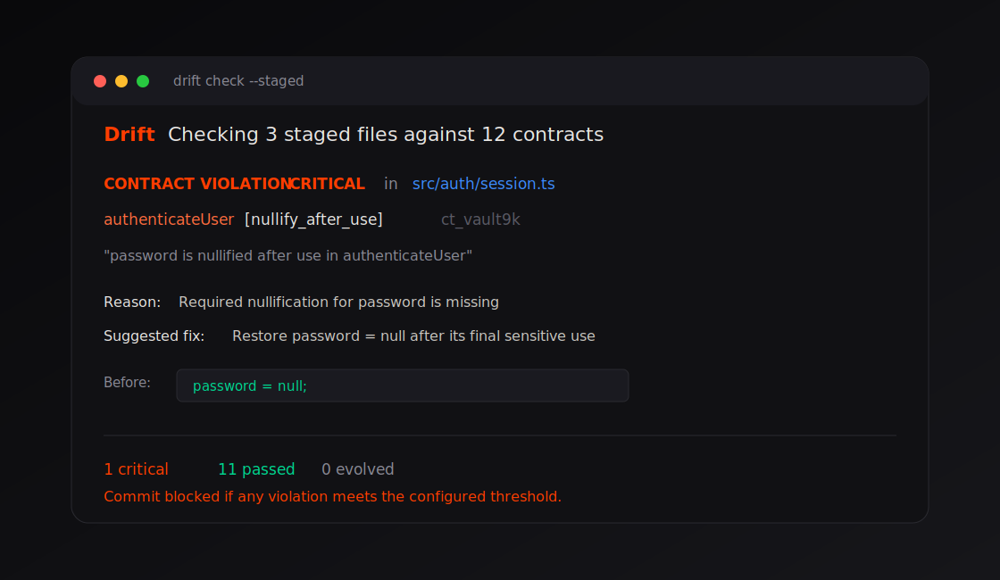

# Drift

[](https://github.com/TKY-27/Drift/actions/workflows/ci.yml)
[](https://www.npmjs.com/package/drift-check)
[](LICENSE)

**Tests pass. Lints pass. But the AI broke your code's meaning.**

Drift is a Semantic Integrity Engine for TypeScript projects. It extracts
semantic contracts from your codebase and blocks changes that violate those
contracts, especially the security-sensitive details tests often miss.



## Why Drift

AI coding agents are excellent at reshaping code. They are also very good at
accidentally removing intent:

- password cleanup after authentication
- authorization before a database write
- rate limits at the start of a handler
- stable return and parameter boundaries
- security-sensitive imports
- side effects that must not disappear

Drift crystallizes those expectations into `.drift/contracts/*.json`, commits
them with your repo, and checks staged or CI changes against the trusted baseline.

No LLMs. No API keys. No cloud service. Static analysis only.

## Trusted Baseline Workflow

```txt
main branch
  .drift/config.json
  .drift/manifest.json
  .drift/contracts/**/*.json
        |
        v
pull request / AI edit
  drift check --staged
  drift ci --baseline-ref origin/main
        |
        v
blocks contract deletion, weakening, ignored critical contracts, and source drift
```

## Installation

```bash
npm install --save-dev drift-check
npm exec drift -- init
npm exec drift -- watch
```

Or run once without adding it first:

```bash
npm exec --package=drift-check drift -- init
```

## Quick Start

```bash
# Extract semantic contracts from the current codebase.
npm exec drift -- init

# Check all crystallized files.
npm exec drift -- check

# Check only staged files before commit.
npm exec drift -- check --staged

# CI mode: JSON output plus trusted baseline integrity checks.
npm exec drift -- ci --baseline-ref origin/main
```

## 30-Second Example

Drift crystallizes security intent:

```ts
const valid = await bcrypt.compare(password, user.passwordHash);
password = null;
```

If an AI refactor removes that cleanup, tests may still pass, but Drift blocks it:

```bash
npm exec drift -- check --staged
# CONTRACT VIOLATION CRITICAL in src/auth/session.ts
# Required nullification for password is missing
```

The first `init` creates reviewable files:

```txt
.drift/config.json
.drift/manifest.json
.drift/contracts/src/auth/session.ts.json
```

Commit those files with the source they describe. CI then compares every PR
against the trusted version on `origin/main`.

## Usage

Run Drift locally before committing security-sensitive TypeScript or JavaScript
changes, and run `drift ci --baseline-ref <trusted-ref>` in CI against a trusted
base branch.

## What Drift Guards

| Contract | What it catches | Example |
| --- | --- | --- |
| Invariant | Behavior that must always or never happen | Sensitive variables are nullified after use |
| Boundary | Input/output behavior | Return type and parameter nullability stay stable |
| Side effect | Required external state changes | Database writes, events, cache mutations, file writes |
| Dependency | Required calls and imports | Authorization happens before side effects |

Current contract patterns include:

- `nullify_after_use`
- `no_log_sensitive`
- `always_validate`
- `rate_limit_enforced`
- `atomic_operation`
- `return_type`
- `param_constraint`
- `nullability`
- `error_boundary`
- `db_write`, `event_emit`, `external_api`, `file_write`, `cache_mutation`
- `guard_clause`
- `must_call`
- `import_constraint`

## What Gets Committed

Drift writes reviewable JSON contracts to:

```txt
.drift/config.json
.drift/manifest.json
.drift/contracts/**/*.json
```

Commit these files. They are the trusted semantic baseline Drift checks in hooks
and CI.

## When To Use Drift

Use Drift when AI agents modify security-sensitive TypeScript code: auth,
payments, audit logging, rate limits, permissions, API clients, and persistence
layers.

Drift is intentionally conservative. It prefers missing a weak signal over
creating noisy contracts teams learn to ignore.

## Requirements

- Node.js 18+
- Git repository for hooks, staged checks, and trusted-baseline CI
- TypeScript or JavaScript source files

## Commands

```bash
drift init                         # create .drift/config.json, contracts, and manifest
drift check                        # verify current files
drift check --staged               # verify Git staged files and staged .drift metadata
drift check --baseline-ref <ref>   # compare .drift against a trusted Git ref
drift ci --baseline-ref <ref>      # JSON output for CI; baseline ref is required
drift watch                        # install a fail-closed pre-commit hook
drift unwatch                      # remove the Drift hook block
drift status                       # show contract summary
drift ls [file]                    # list contracts
drift evolve <id>                  # mark an intentional contract evolution
drift ignore <id>                  # archive a contract
drift add <file>                   # add a manual contract
drift refresh                      # non-destructively refresh generated contracts
```

## Security / Privacy

Drift treats repository files and `.drift` JSON as untrusted input.

- Contract paths are normalized and forced under `.drift/contracts`.
- Evidence snippets are shortened and redacted before storage/output.
- Terminal output strips ANSI/OSC control sequences from untrusted metadata.
- `.drift/manifest.json` records contract hashes, so deletion or weakening is
  reported as an integrity violation.
- `drift check --staged` reads staged source and staged `.drift` metadata from
  the Git index and fails closed on untracked/unstaged `.drift`, binary, or
  unmerged index entries.
- `--baseline-ref <ref>` compares config, manifest, and contracts against a
  trusted Git ref. Integrity violations block regardless of mutable config
  severity thresholds.
- Git hooks require local `./node_modules/.bin/drift`; the hook never falls back
  to `PATH`, `npx`, or network downloads.
- LLM output is disabled in the default config and is never part of trust
  decisions.
- Drift runs locally and does not require API keys or a cloud service for its
  default static-analysis workflow.

See [SECURITY.md](SECURITY.md) for reporting and trust-boundary details.

## CI

Use a trusted base ref in CI:

```yaml
- run: npm ci
- run: npm run build
- run: npm exec drift -- ci --baseline-ref origin/main
```

The included GitHub Actions workflow also runs typecheck, lint, tests, coverage,
build, production dependency audit, and `npm pack --dry-run`.

## Development

```bash
npm ci
npm run typecheck
npm run lint
npm test
npm run test:coverage
npm run build
```

Drift is intentionally conservative: a detector should only create a contract
when it has strong local evidence. False negatives are preferable to noisy
contracts that teach teams to ignore the tool.

## Limitations

Drift is static analysis, not a proof system. It will not understand every
dynamic dispatch pattern, runtime-only dependency, generated file, or business
rule that has no local code signal. Use `drift add` for project-specific
contracts and keep high-risk behavior covered by tests as well.

## Roadmap

See [ROADMAP.md](ROADMAP.md) for the current release roadmap. Near-term work is
focused on improving contract precision, reducing false positives, and expanding
CI/review workflows without changing Drift's local-first security model.

## License

Drift is released under the [MIT License](LICENSE).

## Philosophy

> In the age of AI-generated code, semantic integrity is the new test coverage.

Drift does not replace tests. It guards what tests cannot: the meaning behind
your code.
